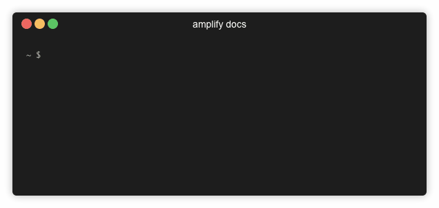

# Amplify Docs

An easy way to view the Amplify Docs from the Amplify CLI.

## Installation

This plugin assumes that the Amplify CLI is already installed. For installation help, please see step 2 of the [getting-started docs](https://aws-amplify.github.io/docs/).

To install, simply enter the following command in your terminal:

`npm i -g amplify-category-docs`

## Usage

| Command                      | Description |
| ---------------------------- | ----------- |
| `amplify docs`               | Launches the selector for the docs. If launched in a project it will auto select the frontend. |
| `amplify docs {opt1}`        | Will launch docs with the option provide. If launched in a project it will auto select the frontend (unless specified). |
| `amplify docs {opt1} {opt2}` | Will launch docs with the option provide. |

## Updating

This plugin is built to be updated from the docs from the amplify docs. To update this plugin from the docs you can run `amplify docs` but you need the developer dependancies. 